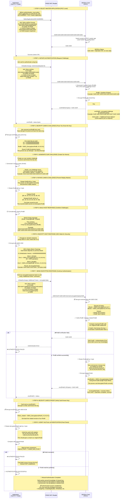

```mermaid
sequenceDiagram
    participant App as Application<br/>(Your C++ Code)
    participant PN532 as PN532 NFC Reader
    participant Card as DESFire Card<br/>(PICC)
    
    Note over App,Card: 🔹 STEP 0: SELECT MASTER APPLICATION (PICC Level)
    Note right of App: Before authentication, must select<br/>which application to authenticate with.<br/>AID 0x000000 = PICC master application
    App->>PN532: SelectApplication(AID=0x000000)
    Note right of App: ISO 7816-4 APDU Format:<br/>CLA=0x90 (DESFire proprietary)<br/>INS=0x5A (SelectApplication)<br/>P1=0x00, P2=0x00<br/>Lc=0x03 (3 bytes of data)<br/>Data=[0x00,0x00,0x00] (AID)<br/>Le=0x00 (expect response)
    PN532->>Card: 0x90 0x5A 0x00 0x00 0x03 0x00 0x00 0x00 0x00
    Card->>Card: Switch context to PICC master app<br/>Load master key configuration
    Card-->>PN532: 0x91 0x00
    Note right of Card: DESFire Status:<br/>0x91 0x00 = Operation OK, no more data
    PN532-->>App: Success (status OK)
    
    Note over App,Card: 🔹 STEP 1: INITIATE AUTHENTICATION (Request Challenge)
    Note right of App: Ask card to authenticate using key #0<br/>Card will send back encrypted challenge
    App->>PN532: InDataExchange: Authenticate(keyNo=0)
    Note right of App: ISO 7816-4 APDU:<br/>CLA=0x90<br/>INS=0x0A (Legacy DES/3DES Auth)<br/>P1=0x00, P2=0x00<br/>Lc=0x01 (1 byte of data)<br/>Data=0x00 (key number = 0)<br/>Le=0x00
    PN532->>Card: 0x90 0x0A 0x00 0x00 0x01 0x00 0x00
    
    Card->>Card: 🎲 Generate 8 random bytes (RndB)<br/>This is the card's challenge nonce
    Note right of Card: RndB = [random 8 bytes]<br/>Example: 0xE6 0x0F 0xD0 0x5A 0xA9 0x36 0x0D 0x36
    
    Card->>Card: 🔐 Encrypt RndB with stored key #0<br/>Using 3DES ECB mode
    Note right of Card: Key #0 (factory default):<br/>K1 = 0x0000000000000000 (8 bytes)<br/>K2 = 0x0000000000000000 (8 bytes)<br/>3DES = DES(K1) → DES⁻¹(K2) → DES(K1)<br/><br/>encRndB = 3DES_Encrypt(RndB, K1-K2-K1)
    
    Card-->>PN532: encRndB (8 bytes) + 0x91 0xAF
    Note right of Card: encRndB = encrypted challenge<br/>(8 ciphertext bytes)<br/>Example: 0x4E 0x9D 0x53 0x3B 0xE3 0xD7 0xDC 0x0B<br/><br/>0x91 0xAF = "Additional Frame follows"<br/>(Card expects you to respond)
    PN532-->>App: encRndB + status bytes
    
    Note over App,Card: 🔹 STEP 2: DECRYPT CARD'S CHALLENGE (Prove You Know the Key)
    Note right of App: We received encRndB from card.<br/>Must decrypt it to prove we have the same key.
    App->>App: 🔓 Decrypt encRndB using same key
    Note right of App: Use same key as card:<br/>K1 = 0x0000000000000000<br/>K2 = 0x0000000000000000<br/><br/>RndB = 3DES_Decrypt(encRndB, K1-K2-K1)<br/><br/>Result: RndB (8 plaintext bytes)<br/>This proves we can decrypt = we know the key!
    
    Note over App,Card: 🔹 STEP 3: GENERATE OUR CHALLENGE (Create Our Nonce)
    Note right of App: Create our own random challenge<br/>to prove card knows the key too
    App->>App: 🎲 Generate 8 random bytes (RndA)
    Note right of App: RndA = our challenge nonce<br/>Generated using secure random:<br/>std::random_device + mt19937_64<br/>Example: 0x31 0x1A 0x20 0x50 0x09 0x71 0x65 0x9F
    
    Note over App,Card: 🔹 STEP 4: ROTATE CARD'S CHALLENGE (Prevent Replay Attacks)
    Note right of App: Rotate RndB left by 1 byte.<br/>This proves we decrypted it correctly<br/>and prevents replay attacks.
    App->>App: 🔄 Rotate RndB left by 1 byte
    Note right of App: Original RndB:<br/>[b0, b1, b2, b3, b4, b5, b6, b7]<br/><br/>Rotated RndB' (left by 1):<br/>[b1, b2, b3, b4, b5, b6, b7, b0]<br/><br/>First byte moved to end.<br/>This transformation proves we decrypted RndB.
    
    Note over App,Card: 🔹 STEP 5: BUILD HOST RESPONSE (Combine Challenges)
    App->>App: 📦 Concatenate: RndA || RndB'
    Note right of App: Build 16-byte message:<br/>[RndA: 8 bytes][RndB': 8 bytes]<br/><br/>This contains:<br/>• Our challenge (RndA)<br/>• Proof we decrypted theirs (RndB')<br/><br/>Example:<br/>0x31 0x1A 0x20 0x50 0x09 0x71 0x65 0x9F<br/>0x0F 0xD0 0x5A 0xA9 0x36 0x0D 0x36 0xE6
    
    Note over App,Card: 🔹 STEP 6: ENCRYPT HOST RESPONSE (CBC Mode for Security)
    Note right of App: Encrypt our 16-byte response<br/>using 3DES in CBC mode with IV=0
    App->>App: 🔐 Encrypt with 3DES CBC
    Note right of App: CBC (Cipher Block Chaining):<br/>Each block depends on previous block<br/><br/>IV (Initialization Vector) = 0x0000000000000000<br/><br/>Block 1 (RndA):<br/>Enc1 = 3DES_Encrypt(RndA ⊕ IV, K1-K2-K1)<br/>(⊕ = XOR operation)<br/><br/>Block 2 (RndB'):<br/>Enc2 = 3DES_Encrypt(RndB' ⊕ Enc1, K1-K2-K1)<br/><br/>Result: 16 encrypted bytes<br/>Example: 0xA4 0xEE 0xC6 0xA2...(16 bytes total)
    
    
    Note over App,Card: 🔹 STEP 7: SEND ENCRYPTED RESPONSE (Continue Authentication)
    Note right of App: Send our encrypted response back to card<br/>using "Additional Frame" command
    App->>PN532: InDataExchange: Additional Frame + encrypted data
    Note right of App: ISO 7816-4 APDU:<br/>CLA=0x90<br/>INS=0xAF (Additional Frame/Continuation)<br/>P1=0x00, P2=0x00<br/>Lc=0x10 (16 bytes of data)<br/>Data=[16 encrypted bytes]<br/>Le=0x00
    PN532->>Card: 0x90 0xAF 0x00 0x00 0x10 [16 encrypted bytes] 0x00
    
    Card->>Card: 🔓 Decrypt received data with 3DES CBC
    Note right of Card: Decrypt 16 bytes:<br/>Block1 = 3DES_Decrypt(Enc1) ⊕ IV<br/>Block2 = 3DES_Decrypt(Enc2) ⊕ Enc1<br/><br/>Extract:<br/>• RndA' (first 8 bytes)<br/>• RndB' (last 8 bytes)
    
    Card->>Card: ✅ Verify RndB' matches rotated RndB
    Note right of Card: Compare received RndB' with<br/>our original RndB rotated left.<br/><br/>If match: Host knows the key! ✓<br/>If mismatch: Authentication fails ✗
    
    alt ❌ RndB verification fails
        Card-->>PN532: 0x91 0xAE
        Note right of Card: 0x91 0xAE = Authentication Error<br/>(Host didn't prove key knowledge)
        PN532-->>App: Authentication Error
        App->>App: ❌ AUTHENTICATION FAILED
    else ✅ RndB verified successfully
        Card->>Card: 🔄 Rotate RndA left by 1 byte
        Note right of Card: Now card proves it knows key<br/>by rotating our RndA:<br/>[a0,a1,a2,a3,a4,a5,a6,a7]<br/>→ [a1,a2,a3,a4,a5,a6,a7,a0]
        
        Card->>Card: 🔐 Encrypt rotated RndA
        Note right of Card: enc(RndA') = 3DES_Encrypt(rotated_RndA)<br/>Using ECB mode (single 8-byte block)<br/><br/>This proves card decrypted RndA correctly
        
        Card-->>PN532: enc(RndA') (8 bytes) + 0x91 0x00
        Note right of Card: 8 encrypted bytes + success status<br/>0x91 0x00 = Operation complete, success
        PN532-->>App: enc(RndA') + status
    end
    
    Note over App,Card: 🔹 STEP 8: DECRYPT CARD'S PROOF (Verify Card Knows Key)
    Note right of App: Card sent us enc(RndA').<br/>Decrypt to verify card knows the key.
    App->>App: 🔓 Decrypt enc(RndA') with 3DES ECB
    Note right of App: RndA_rotated = 3DES_Decrypt(enc(RndA'), K1-K2-K1)<br/><br/>Get back the rotated version of our RndA
    
    Note over App,Card: 🔹 STEP 9: VERIFY MUTUAL AUTHENTICATION (Final Check)
    App->>App: 🔄 Rotate decrypted RndA right by 1 byte
    Note right of App: Undo the card's left rotation:<br/>[a1,a2,a3,a4,a5,a6,a7,a0]<br/>→ [a0,a1,a2,a3,a4,a5,a6,a7]<br/><br/>This should give us back our original RndA
    
    App->>App: Compare with original RndA
    Note right of App: Byte-by-byte comparison:<br/>original_RndA == rotated_back_RndA ?
    
    alt ❌ RndA mismatch
        App->>App: ❌ AUTHENTICATION FAILED
        Note right of App: Card didn't prove it knows the key!<br/>Session NOT established.
    else ✅ RndA matches perfectly
        App->>App: ✅ AUTHENTICATION SUCCESSFUL!
        Note over App,Card: 🎉 Mutual Authentication Complete!<br/><br/>Both parties proved knowledge of shared key:<br/>• Host proved it by decrypting & rotating RndB<br/>• Card proved it by decrypting & rotating RndA<br/><br/>🔓 Authenticated session established<br/>Can now execute privileged commands:<br/>• ChangeKey, CreateApplication, WriteData, etc.
    end
```